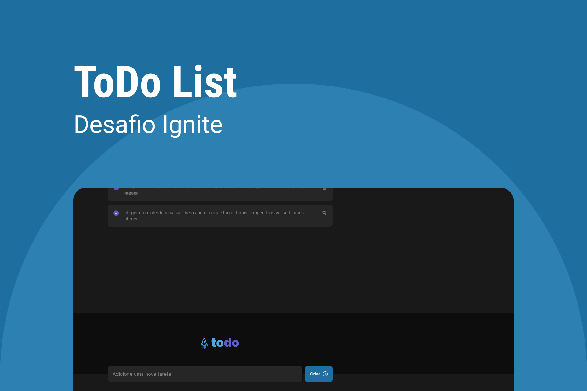

[🔗 Link para o projeto online](https://ignite-praticando-conceitos.vercel.app/)

&nbsp;

<div>
  
</div>

<br/>

## 📚 Informações sobre o projeto

- Uma aplicação de controle de tarefas no estilo **to-do list**, que contém as seguintes funcionalidades:

- Adicionar uma nova tarefa
- Marcar e desmarcar uma tarefa como concluída
- Remover uma tarefa da listagem
- Mostrar o progresso de conclusão das tarefas

Apesar de serem poucas funcionalidades, precisa relembrar conceitos como:

- Estados
- Imutabilidade do estado
- Listas e chaves no ReactJS
- Propriedades
- Componentização

&nbsp;

## 🖼️ Template do projeto Figma

- [Template do projeto original para clone](https://www.figma.com/file/G8193zMPFTdf6fwEUzF7Pw/ToDo-List-Copy?fuid=975921817161406319)

<br/>

## 🛠️ Tecnologias/Ferramentas ultilizadas

- [React](https://pt-br.reactjs.org/E)
- [Vitejs](https://vitejs.dev/)
- [TypeScript](https://www.typescriptlang.org/)
- [phosphor-icons](https://phosphoricons.com/)

## ⚙️ Instalação

```
# Abra um terminal e copie este repositório com o comando
$ git clone https://github.com/Hugovarellaa/ignite-praticando-conceitos
```

```
# Acesse a pasta da aplicação
$ cd ignite-praticando-conceitos

# Instale as dependências
$ npm install ou yarn 

# Inicie a aplicação
$ npm run dev ou yarn dev 

```

---

<p align="center">Feito com 💙 por Hugo Alves Varella</p>
